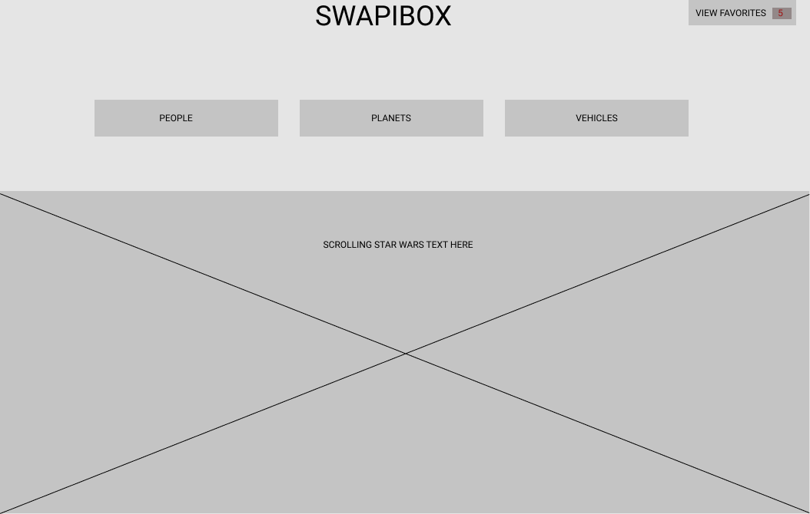

# **SWAPI-BOX**

*SWAPI-BOX* is a web based application built in React that uses asynchronous fetch calls to a Star Wars API. Character, planet, people and vehicle data is then cleaned and organized into a fun UI with reusable React components. Users can browse throught these various categories and bookmark their favorite cards. Router is implemented for page navigation.

### Project Goals: 
* Asynchronously call and clean data ONLY when the user requests it.
* Separate application logic into small, testable functions.
* Create modular, reusable React components.
* Implement React-Router for natural page navigation.
* Create a well thought-out UI.
* Use propTypes to validate props passed to each component.
* Write meaningful, comprehensive unit and integration tests.

### Original Wireframe:

### Installation and Setup Instructions

1. Clone down this repository.

2. cd into directory.

3. Run `npm install` in terminal.

4. Run `npm start` in terminal to start server.

### Contributors 

* Ashley Levi
* Tanjie Mcmeans https://github.com/TMcMeans

